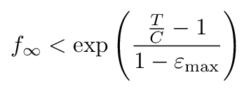

# DoubleDice $DODI Token

## Overview

The `DoubleDiceToken` contract implements the ERC-20 token specification by inheriting from `@openzeppelin/contracts@v4.3.2`’s `ERC20` contract, and extends it with functionality enabling holders of the token (symbol `DODI`) to receive yield on their token holdings in denominations of the same DODI token.

The contract also inherits the OpenZeppelin `Ownable` contract, so by default the account deploying the contract becomes the `owner` of the contract. The `owner` may then choose to transfer ownership of the `DoubleDiceToken` contract to a different account. Some functions on the contract are exclusive to the `owner`, and are listed in the [Distributing yield](#distributing-yield) section below.

## Token supply

The maximum possible `totalSupply`, `initTotalSupply` (constructor arg), is minted on contract creation, and no further tokens can be minted thereafter.

A portion `totalYieldAmount` of this supply is reserved for distribution to future token-holders as yield. This portion of the supply is minted to a reserved address `UNDISTRIBUTED_YIELD_ACCOUNT`. The private key corresponding to this address is unknown (much like the private key for `address(0)` and other “black hole” addresses). By keeping these tokens on this account’s balance, it is possible to leverage the inherited ERC-20 functions to manage these funds. Moreover, managing these funds as a regular ERC-20 balance on a reserved address integrates nicely with the existing tools, e.g. it would always be possible for anyone to check the the amount of undistributed yield [directly on Etherscan](https://etherscan.io/address/0xcC00000000000000000000000000000000000001).

The rest of the supply is minted to the `initTokenHolder`, who may then transfer them to other accounts using regular ERC-20 `transfer`.

Token holders may perform all the standard ERC-20 functions with their tokens.

Token holders cannot mint or burn tokens, but the `owner` may choose to burn a portion of the tokens held on `UNDISTRIBUTED_YIELD_ACCOUNT`, resulting in a decrease in the overall `totalSupply`.

## Yield

The contract inherits the OpenZeppelin `Ownable` contract, so by default the account deploying the contract becomes the `owner` of the contract. The `owner` may then choose to transfer ownership to a different account. The `owner` is authorized to perform two specific operations:

- The `owner` may `distributeYield` from the undistributed yield reserves to all token-holders.
- The `owner` may choose to `burnUndistributedYield` sitting in the undistributed yield reserves.

### Distributing yield

When yield is distributed, the `owner` makes a transaction to `distributeYield` specifying an `amount` of tokens to distribute to all token holders, as well as an optional (short) list of `excludedAccounts` to exclude from that specific yield-distribution round.

One scenario in which it is envisaged that `excludedAccounts` would be used is in the scenario of a decentralized-exchange (DEX) contract holding DODI tokens. The design of the ERC-20 specification precludes a contract holding ERC-20 tokens from “knowing” that it has received those tokens. Therefore, if the DEX contract address were not excluded from a yield-distribution, the tokens held in that DEX would receive yield that would go to waste because that yield would not be “on the DEX’s books”, so to speak.

When the `owner` distributes an `amount` of DODI as yield, these are not `transfer`-ed to all DODI holders one by one during the `distributeYield` transaction, as blockchain gas fees would prevent this from scaling to beyond a handful of recipients. Instead the `amount` of tokens is transferred from the balance on `UNDISTRIBUTED_YIELD_ACCOUNT` to the balance of a second reserved address `UNCLAIMED_DISTRIBUTED_YIELD_ACCOUNT`, from where it will be claimed by the recipients. 

### Claiming yield

So for a specific `account`, receiving yield from a distribution will not immediately appear on its `balanceOf(account)`. Instead, the received yield will appear instantly on `unclaimedYieldOf(account)` and `balancePlusUnclaimedYieldOf(account)`. For the yield to appear on the official ERC-20 `balanceOf(account)`, `account` must make a transaction to `claimYield()`.

Optionally any third party can make a transaction to `claimFor(account)` on `account`’s behalf, and this will have the same result as `account` claiming its own yield. This can be useful in cases where an account is unable to call `claimYield()` on its own behalf, as could be the case for some contract wallet implementations.

If an `amount` of tokens is distributed, the portion of tokens received by `account` will be in linear proportion to `balancePlusUnclaimedYieldOf(account)` at the moment of the distribution.  Once an amount of yield is received by an account, there is no “expiry” on that claim. If by the time the next yield-distribution round comes along, an account holder will not have yet claimed the yield received in the first round, the yield claims will simply accumulate. Indeed, since `balancePlusUnclaimedYieldOf(account)`includes `unclaimedYieldOf(account)`, this means that as a result of the second distribution round, `account` will receive yield not only on `balanceOf(account)`, but will also receive yield also on the `unclaimedYieldOf(account)` from the first round that it has not yet claimed.

A successful yield-claim by or for `account` will result in the amount `unclaimedYieldOf(account)` of DODI tokens being transferred from `UNCLAIMED_DISTRIBUTED_YIELD_ACCOUNT` to `account`. Since the unclaimed yield is kept as a regular DODI balance on the reserved `UNCLAIMED_DISTRIBUTED_YIELD_ACCOUNT`, a yield-claim will emit an ERC-20 `Transfer` event `from` this reserved account.

#### Note about transfers

Note that if `account1` transfers an amount of DODI to `account2`, this will affect `balanceOf(account1)` and `balanceOf(account2)`, but it will have no effect on `unclaimedYieldOf(account1)` and `unclaimedYieldOf(account2)`. If `account1` wants to transfer to `account2` its entire `balancePlusUnclaimedYieldOf(account1)` tokens, then `account1` must first call `claimYield`  to “move” its unclaimed yield from `unclaimedYieldOf(account1)` to `balanceOf(account1)`, and _then_ execute a regular ERC-20 transfer of its entire balance.

## Algorithm

Suppose that an `initTotalSupply` of `110` tokens are split `10 | 100` between `UNDISTRIBUTED | initTokenHolder`, and `initTokenHolder` then transfers the `50` to user `a` and `50` to user `b`. So the split `UNDISTRIBUTED | a | b` is `10 | 50 | 50`.

The `owner` distributes `4` tokens without excluding any account from the distribution (`distributeYield(10, [])`). Since there are `50 + 50 = 100` tokens circulating (the other `10` are out of circulation, reserved for yield distributions), and neither `a` nor `b` are to be excluded from the distribution, the `includedCirculatingSupplyBefore` the distribution is `100`. After the `4` are distributed, and hence `transfer`-ed from `UNDISTRIBUTED` to `UNCLAIMED`, the `includedCirculatingSupplyAfter` will be `100 + 4 = 104`. Therefore as a result of this distribution, the `circulatingSupply` increases by a factor of `104/100 = 1.04`. This value of `1.04` is referred to in this documentation as the value `f`.

:information_source: In the contract, this `f` value is stored as `_factor = (f - 1) * ONE`. The value of `ONE` is fixed in the contract to `10 ** k`, where `k` is set to the largest value possible that can be proven mathematically to never result in `uint256` overflow. This explained in more detail in the [Rounding error](#rounding-error) section.

For each yield-receiving `account`, the contract maintains a tuple `entries[account] = (balance, unclaimedAtLastF, lastF)`. On contract deployment, every account begins with an entry `(0, 0, 1)`.

`entries[account].balance` is `account`’s ERC-20 balance.  :information_source: Although `balance` is _conceptually_ a member of the tuple, in the actual contract implementation it is held separately in the `_balances` mapping in the base `ERC20` contract. This could change in a future re-implementation of the contract.

`entries[account].unclaimedAtLastF` is a snapshot of the amount of unclaimed tokens for that account at a timepoint ≤ now. Its value is refreshed _lazily_ just before:

1. Either `account` is about to be at the sending or receiving end of a DODI `transfer` or `transferFrom`,
2. or `account` is about to `claimYield`,
3. or `account` is to be excluded from a `distributeYield`.

Every time `entries[account].unclaimedAtLastF` is refreshed, the global `f` at the moment of the refresh is recorded in `entries[account].lastF`.

Returning to the distribution example: After the `4` are distributed as yield to all token holders `a` and `b`, the global `f` is at a value of `1.04`. Because `entry.unclaimedAtLastF` is only updated lazily, `a` and `b` still have entries `(50, 0, 1)` and `(50, 0, 1)`, despite having been awarded yield. In fact, the only “place” their entitlement to claiming yield is recorded, is in the discrepancy between their `lastF = 1` and the global `f = 1.04`.

If it is absolutely necessary to refresh `a`’s `unclaimedAtLastF`, this is carried out as follows (in `_captureUnclaimedYield`):

The last time `entries[a].unclaimedAtLastF` had been captured, when `f` was `1`, `a` was owning a total of `balance + unclaimed = 50 + 0 = 50` tokens. Since `f` has now increased from `1` to `1.04`, those `50` have now become `50 * 1.04 = 52`. This is reflected immediately in `balancePlusUnclaimedYieldOf(a)`, which will return `52` immediately following `distributeYield`. Since the on-book `balanceOf(a)` is `50`, this means that `unclaimedYieldOf(a)` is `2`.

After being refreshed, `entries[a]` will be `(50, 2, 1.04)`. As long as the global `f` remains at `1.04`, it will be possible to compare `a`’s `entry.lastF = 1.04` to the global `f = 1.04` and deduce that no further yield has been distributed since `entries[a]` was last refreshed.

### Excluding an account from yield distribution

If a particular token holder is to be _excluded_ from a specific yield-distribution, `f` needs amplified by a value larger than normal because the yield being distributed is going to be divided among less tokens.

For example consider a scenario where a `totalSupply` of `110` is split `10 | 49 | 49 | 2` between `UNDISTRIBUTED | a | b | c`. The `owner` wants to distribute `4` as yield to all DODI holders, but wants to exclude `c` from this round. This is achieved by calling `distributeYield(4, [c])`. The global `f` is updated as follows:

```python
f′ = f * ((49 + 49) + 4) / (49 + 49) = f * 102/98
```

This means that now the `49` tokens before the distribution will be worth `102/98 * 49 = 51`. But the `2` that are excluded from the distribution, are only “removed from circulation” for the “duration” of the distribution, and “put back into circulation” straight after. So if no precaution were to be taken, they too would get to benefit from this increased `f`. Indeed, without any further corrections, the `2` would now have become `102/98 * 2 = 2.08`, and `c` would be able to claim `0.08` DODI. But this situation is avoided because during distribution, the `entry[c].lastF` is “fast-forwarded” from `1` to `1.04`, so `c` gets to “miss out” on this yield distribution round.

## Rounding error

There are two sources of rounding error in the contract:

1. `balancePlusUnclaimedYieldOf(a)` is calculated as:

   ```
                                    ((ONE + _factor) * (balanceOf(a) + entries[a].capturedUnclaimedYield))
   balancePlusUnclaimedYieldOf(a) = ──────────────────────────────────────────────────────────────────────
                                                        (ONE + entry.factorAtCapture)
   ```

   Because the integer division rounds down, any fractional “dust” in the result will remain locked in the contract forever (on `UNCLAIMED_DISTRIBUTED_YIELD_ACCOUNT`’s DODI balance). It would be not worth the added complexity (and gas costs) of tracking this dust, so it is left as is.
   
2. In `distributeYield`, `_factor` is updated as follows:

   ```solidity
   _factor = ((ONE + _factor) * includedCirculatingSupplyAfter) / includedCirculatingSupplyBefore - ONE
   ```

   The value of `_factor` has an impact on all calculations, so it is of paramount importance to keep this value as precise as possible. The precision of `_factor` is controlled by the magnitude of the multiplier `ONE`, but the value of `ONE` has to be such that it can be theoretically guaranteed that the smart contract will never overflow.

### Overflow analysis

The contract attains its highest integer values in the numerators of the computations in `balancePlusUnclaimedYieldOf` and `distributeYield`:

```solidity
// balancePlusUnclaimedYieldOf
numerator1 = (ONE + _factor) * (balanceOf(account) + entry.capturedUnclaimedYield)

// distributeYield
numerator2 = (ONE + _factor) * includedCirculatingSupplyAfter
```

In both scenarios, the value `ONE + _factor` is being multiplied by a token amount, and token amounts are by definition always upper-bounded by `totalSupply()`. Since no tokens are minted from deployment onwards, `tokenSupply() ≤ initTokenSupply` always holds true. Writing `T` as shorthand for `initTokenSupply`, and substituting `_factor = (f - 1) * ONE`, the condition for preventing `uint256` overflow may be expressed as the following inequality:

```solidity
f * ONE * T ≤ type(uint256).max
```

Let:

- Let the value of `f` on contract deployment be `f_0 = 1`, be `f_1` after the 1<sup>st</sup> `distributeYield`, be `f_2` after the 2<sup>nd</sup> `distributeYield`, etc. Then the value of `f` after an infinite number of yield-distributions is `f_∞`
- Let `T/C` be the ratio of the `initTotalSupply` to the initial total circulation supply, i.e. `initTotalSupply / (initTotalSupply - totalYieldAmount`)

- Let `ε_max` be a parameter controlling the maximum proportion of the circulating supply that can be excluded from receiving yield in every `distributeYield` round

Then [it can be proven](./docs/upper-bound-derivation.pdf) that the value of `f` after an infinite number of calls to `distributeYield` will satisfy the follow inequality:



By enforcing the following constraints in the contract:

1. `require`-ing in the `constructor` that `T ≤ MAX_T`,
2. `require`-ing in the `constructor` that `T/C ≤ MAX_T_OVER_C`,
3. `require`-ing in `distributeYield` that `ε ≤ MAX_ε`,

Then it is possible to fix `ONE` to the largest value possible that will maintain:

```solidity
exp((MAX_T_OVER_C - 1) / (1 - MAX_EPSILON)) * ONE * MAX_T ≤ type(uint256).max
```

E.g. for `MAX_T_OVER_C = 2`, `MAX_EPSILON = 0.5` and `MAX_T = 20e9 * 1e18`,  then `ONE ≤ 7.84e47`, so `ONE` could be set to `10 ** 47` and the largest computation would be guaranteed to always fit in a `uint256`.

The [calculate_DoubleDiceToken_ONE.py](./calculate_DoubleDiceToken_ONE.py) script will perform this calculation.

#### Adherence to theoretical upper-bound

In practice, `_factor` begins from a value of `0`, and then is updated from one `distributeYield` call to to the next, as follows:

```solidity
_factor = ((ONE + _factor) * includedCirculatingSupplyAfter) / includedCirculatingSupplyBefore - ONE
```

Since integer division rounds _down_, after an infinite number of `distributeYield`s, the value of `_factor` might end up being _smaller_ than it should be in theory, but never larger. Hence there is no concern that rounding-errors may lead to this computation exceeding its proven theoretical upper-bound.

# Other documentation

- [DoubleDiceTokenVesting contract](./docs/OTHER.md)
- [DoubleDiceTokenVestingProxy contract](./docs/EN-05.md)
# doubledice-token
# doubledice-token
# doubledice-token
# doubledice-token
